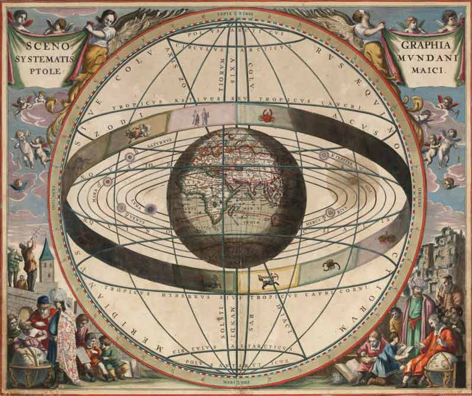
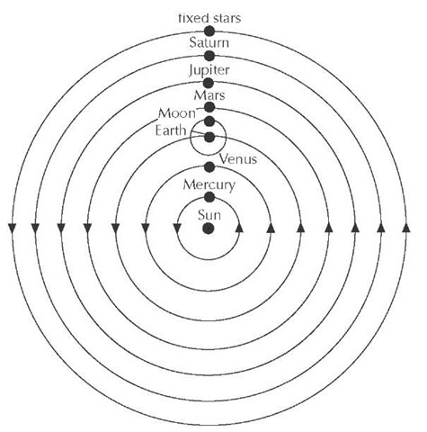

# Some perspectives #

## Events of the 14th c. ##

- The Avignon papacy transfers the seat of the Popes from Italy to
  France
- The Great Famine of 1315-1317 kills millions of people in Europe.
- Beginning of the Renaissance in Italy
- The Hundred Years' War begins when Edward III of England lays claim
  to the French throne. (1337) The French recruit troops and ships in
  Genoa, Monaco, and Nice (1345--1346).
- Black Death kills around a third of the population of Europe.
  (1347--1351).
- The Great Schism of the West begins in 1378, eventually leading to 3
  simultaneous popes.
- The poet Petrarch coins the term *Dark Ages* to describe the
  preceding 900 years in Europe, beginning with the fall of the
  Western Roman Empire in 476 through to the renewal embodied in the **Renaissance**.

## Vocabulary ##

- nepotism: handing out positions to family members
- pluralism: illegally hold more than one clergy position
- ignorance: esp. of clergy
- indulgences
- absenteeism: clergy did not live in their diocese or parishes
- worldliness: clergy got drunk, lead armies, fathered children,
  gambled etc.

## Competing Views of World / Universe ##

### Ptolemaic system ###

### Copernican system ###

## Protest against Church authority ##

- Competing popes
- Church offices for sale
- John Wycliffe: the Bible could provide foundation to reform Church authority
- John Hus: populist, all should receive communion, clergy are corrupt

# Misc #

- cf. ch. 14 for Zwinglian developments
- justification by faith (though we remain sinners) -- imagine if you will that God looks on our blackboard, covered in scritches and scratches of efforts, good and bad, but sees a **clean washed blackboard**.
- continued debate about the role of grace and our participation with it
- increasingly "faith" meant an "assent to a set of propositions." *p. 167*

## Excerpts from previous presentations ##

- One of the major things I learned while reading this chapter is that Luther was resposible for many of the critical changes in the church. Specifically, his emphasis on faith. Luther stressed the fact that faith because of the many instances of corruption in the Catholic church.
- The debate over the Spirit or Holy Spirit was really interesting to me. Andreas Bodenstein von Carlstadt, a colleague of Luther, "thought that the voice of the Holy Spirit could speak directly to any Christian" (p. 158), in which Luther thought this was not a good idea, since Luther believed that Scripture was more important.
- Thomas Muntzer also believed that the Spirit was more important than Scriptures, claiming that "the Spirit could speak even to those who lacked the education needed for biblical scholarship" (p. 158).
- I found it surprising how discouraging Luther was towards political rebellion. I mean, I disagree with his ideals of people living for simplicity of the common good. If there is not change present, then corruption continues. I would think Luther would want reformation of the corruption of the church intertwined with the political system.
- It wasn't as surprising as it was interesting to discover the origin of Mennonites (or the Amish as I thought). It is weird to think that something as simple as adult baptism really separated Christians. I could really see the importance of scripture as the highest authority because people have their own views on how to interpret scripture. Luther seemed as if he wanted to take it literally, but he holds many contradictions to this. "
- Luther addresses in the excerpt that everyone has a priesthood but not everyone can perform ceromonies Are the ceromonies he is speaking of sacraments, like baptism and communion? If so, what does he mean by that?
- Being saved by faith alone surprised me because I was taught that faith means: "a strong belief in God or in the doctrines of a religion, based on spiritual apprehension rather than proof." And my youth pastor used to say that he has no faith the bible is real, he knows it.
- Luther did not expect his beliefs about the authority of scripture to be viewed as rebellious and heretical! It was also viewed as quite shocking that he got married.
- Humanists were mentioned in this chapter, but I struggled to fully comprehend what they believed and how it differed from the Orthodox Church (as well as Luther's teachings).
- Luther changed the entire christian theology by standing his ground and calling out the wrong doings of the church. I also found it important when Luther stated that even without the bible one can come to know Christianity on a spiritual level just as those who wrote the bible did before them.
- If a person does not know God and is of a certain age we consider them to be saved still if they die young. This theory of Luthers would imply that anyone can know God without proper exposure and therefore could potentially distroy the original belief.
- Luther's revolution was accidental, -- Grebel and friends rebaptism of one another after deciding that infant baptisms are invalid."
- I was surprised that such a thing as Christian mysticism exists. Eckhart's theory risked blurring the distinction between God and His creatures, so that humans could be considered divine through their connection with God. This reminded me of the Hindu philosophy that all individual souls are one united, divine being.

