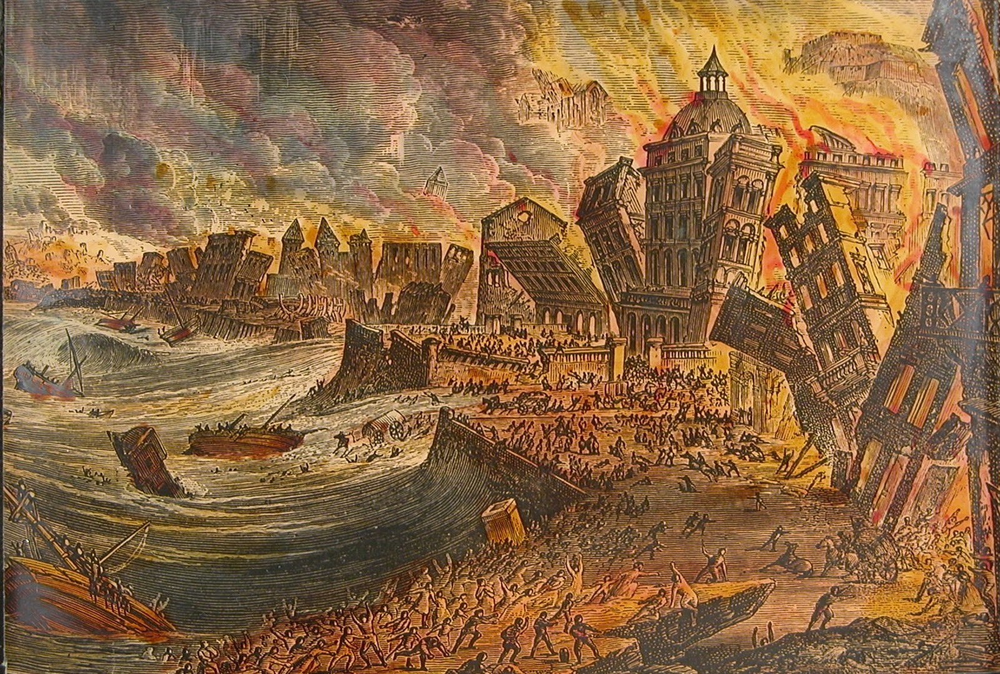
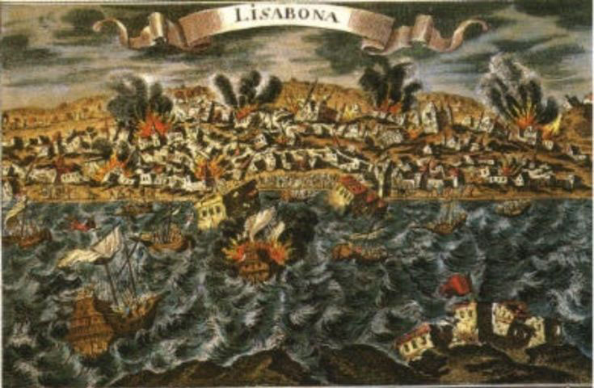

# Age of Expansion

## 6. Ch. 15: Reason and Enthusiasm

### Enlightenment ###

#### Rationality ####

- History of a metaphor
- Arguments for God: *a priori* and *empirical*
- Calvin's systematic development of the faith position **sovereignty of God**
- Quakers and Nonconformists: where is highest authority placed?
- Descartes: from scientific method to rational conclusions

#### Religion and the Age of Reason ####

##### San Francisco #####

##### Earthquakes #####

##### Earthquakes and God's will #####

- a tale of 2 earthquakes
- he found the evidence for his belief in nature rather than in the Bible; he doubted a good bit of traditional doctrine—and he didn’t treat religion all that seriously.
- Revivals but at heart a move from God to human beings

##### Voltaire #####
   
   - a tale of 2 earthquakes
   - he found the evidence for his belief in nature rather than in the Bible; he doubted a good bit of traditional doctrine—and he didn’t treat religion all that seriously.
   - Revivals but at heart a move from God to human beings
   
   

   Do we explain these by reference to God? No? We are inheritors of Enlightenment.
   
   p. 203 it is the **shifting of place** re. God and world --; what is important
   
   

###### Earthquakes and God's will ######

###### From God-centered to Human-centered ######
   
   1. 5 catalysts for change (204)
   1. wars of religion
   2. Europe divided
   3. philosophical attitudes encouraged questioning tradition
   4. science seemed to being moving from one accomplishment to another ...;
   5. nationalism taking root, centralizing power

 at the very time of success in discovery and technology, reason seemed to reach its end of life

##### From God-centered to Human-centered #####

- 5 catalysts for change
- at the very time of success in discovery and technology, reason seemed to reach its end of life
- changing metaphor from Anselm to Descartes

#### Religion of Reason ####

- Cartesian coordinates
- can a religion be built on Doubt?
- No man shall ever be kept out of Heaven … if he had but an honest and good heart, that was ready to comply with Christ’s commandments
- God is more inward to us than our very souls

##### Descartes to Newton #####

- Newton: God’s "immensity" stretching infinitely in all directions and unchanged for all eternity (cp. changing metaphor)
- while retaining religion, it is no stripped of the "supernatural"
- Church of England would keep its theology vague enough to include as many groups as possible and tolerate the presence of some dissenting groups like Anabaptists and Quakers, though not Catholics

##### Locke and Deists #####

- Nearly all the attitudes of the time came together in John Locke
- <https://www.youtube.com/watch?v=kItXvJLnTtk>
- Many Deists brought to bear on the biblical miracle stories all the prestige of the scientific discovery of laws
- Deists distrusted appeals to authority and the miraculous, but they also turned away from anything beyond natural religion in part for moral reasons.

##### Pietists and Methodists #####

- "**Enthusiasm**" was a dirty word in the eighteenth century.
- story begins in Germany, where Lutheran orthodoxy had increasingly defined faith as assent to a set of doctrines
- Lutherans suspect any call to moral improvement as a move toward works-righteousness.
- Methodism with a "method" for holiness
- Wesley and Whitefield changed the shape of popular religion in England and North America, but they made little impact on the attitudes among most intellectuals

##### The end of Reason #####

- Hume
- Rousseau
- Kant

#### Notes: Religion and the Age of Reason ####

Notes:
 
 

 
 San Francisco earthquake 1906
 lead to the rise of Pentecostalism
 preaching at Azusa, CA

 <https://lifeafter40.net/the-1755-lisbon-earthquake-the-start-of-atheism/>
 For an account of how this gave birth to "atheism" --; read to get a feel for it

 
 
 
 

### Religion & Philosophy ###

#### Descartes to Newton ####

##### Newton on religion #####
   
   - Newton: God’s "immensity" stretching infinitely in all directions and unchanged for all eternity (cp. changing metaphor) (cp. Borges)
   - what was most important about religion was its morality --; cf. Jefferson's approach (206)
   - while retaining religion, it is no stripped of the "supernatural"
   - "natural religion" (206)
   - Church of England would keep its theology vague enough to include as many groups as possible and tolerate the presence of some dissenting groups like Anabaptists and Quakers, though not Catholics
   
   

   cf. 3 parts of Anglican: hi, lo, broad
   
   

##### Note: cf. Borges #####
   
   "Universal history is the history of a handful of metaphors"
   
   - changing metaphor from Anselm to Descartes
   
   

   read from *Labyrinths* "The fearful sphere of Pascal"
   
   

   
##### Locke and Deists #####

   - Nearly all the attitudes of the time came together in John Locke (207)
   
   - <https://www.youtube.com/watch?v=kItXvJLnTtk>
   
   - Many Deists brought to bear on the biblical miracle stories all the prestige of the scientific discovery of laws (209)
   
   - Deists distrusted appeals to authority and the miraculous, but they also turned away from anything beyond natural religion in part for moral reasons.

##### Religion of Reason #####
   
   Descartes argued that knowledge would come only from doubting everything
   
   - can a religion be built on Doubt?
   - No man shall ever be kept out of Heaven … if he had but an honest and good heart, that was ready to comply with Christ’s commandments (205)
   - God is more inward to us than our very souls (205)
   - Pietists and Methodists
   - "**Enthusiasm**" was a dirty word in the eighteenth century. (210)
   - story begins in Germany, where Lutheran orthodoxy had increasingly defined faith as assent to a set of doctrines
   - Lutherans suspect any call to moral improvement as a move toward works-righteousness.
   - rise of **Pietism** (210)
   - Moravians and J. Wesley intersect (211)
   - Methodism with a "method" for holiness
   - Wesley and Whitefield changed the shape of popular religion in England and North America, but they made little impact on the attitudes among most intellectuals
   
   

   Read Wesley quote of his conversion p. 211
   
   nb. that for Wesley, too, morality was more important than doctrine
   
   

#### The end of Age of Reason ####

##### Hume #####
   
   - skeptic of scientific inference producing absolute knowledge
   - apply skepticism to argument from order; miracles; and others ...;

##### Rousseau #####
   
- doubting even **civilization** --; cf. *Emile* raised as a **natural child**
- follow self & respect others (214)
- Lessing: story of 3 rings (214)
   
   

   see how we identify with the motto of Rousseau above
   
   

### Enlightenment to city on a hill ###

#### Reason and Enthusiasm (Enlightenment) ####

##### Religion of reason #####

- Cambridge Platonists (Isaac Newton) p. 205 ######

- John Locke (most influential English philosopher of his day *The reasonableness of Christianity* (Locke) ######

##### Enthusiasm: Pietists and Methodists #####

- German pietism (210) 
- Wesley "denied baptismal regeneration" providing **only** an outward sign (211)

##### Real change occurs when we experience ... #####

- **born again** #
- John Wesley

#### End of the Age of Reason ####

- David Hume, "asking embarrassing questions about scientific method" (213), **question about what we can know** ...; scepticism
- Rousseau, Lessing ... Christian, Jews, Muslims should all follow God and humanity in own ways (215)
- Kant "sought religion independent of historical facts about Jesus" ... cf. also his morality ... "Kant believed in God and grace, but not in most of Christian theology."

## 7. Ch. 16: City on a Hill (America)

### from Enlightenment to a New World ###

##### Locke and the Deists #####

-   nearly all the attitudes of the time came together in John Locke
-   <https://www.youtube.com/watch?v=kitxvjlnttk>
-   many Deists brought to bear on the biblical miracle stories all the
    prestige of the scientific discovery of laws
-   deists distrusted appeals to authority and the miraculous, but they
    also turned away from anything beyond natural religion in part for
    moral reasons.

##### Pietists and Methodists #####

-   "**enthusiasm**" was a dirty word in the eighteenth century.
-   story begins in germany, where lutheran orthodoxy had increasingly
    defined faith as assent to a set of doctrines
-   Lutherans suspect any call to moral improvement as a move toward
    works-righteousness.
-   Methodism with a "method" for holiness
-   wesley and Whitefield changed the shape of popular religion in
    England and North America, but they made little impact on the
    attitudes among most intellectuals

##### the end of reason #####

-   Hume
-   Rousseau
-   Kant

### City on a Hill presentations ###

#### Overview themes of Church in America ####

- the **idea** of **denomination** really developed in the US
- bewildering variety of developments in US (219)
- New England's covenant with God (219)
- Rational religion in the US (224)
- Revivals on the frontier (225)
- Romanticism in America (228)
- Slavery and black religion (230)
#### Key figures ####

- John Winthrop
- Jonathan Edwards
- Great Awakening
- Grimke 

#### City on a Hill ####

-   the **idea** of **denomination** really developed in the us
-   bewildering variety of developments in us (219)
-   *Indeed I tremble for my country when I reflect that God is just.* --Thomas Jefferson

::: {.NOTES}
Notes:

-   any story of church in America must acknowledge the denominationalism
-   What does the epigraph mean?
:::

 {#section reveal_background="http://izquotes.com/quotes-pictures/quote-for-we-must-consider-that-we-shall-be-as-a-city-upon-a-hill-the-eyes-of-all-people-are-upon-us-so-john-winthrop-311908.jpg" reveal_background_size="1100px" reveal_background_trans="slide"}

::: {.NOTES}
note: The vision of a light to the nations.

Quote from Bible. Identifying with a line from Ancient Israel. (Is 49.6)
:::

 {#section-1 reveal_background="http://www.memorywebs.org/Winthrop_John_CityUponHillSpeech1630.jpg" reveal_background_size="1100px" reveal_background_trans="slide"}

::: {.NOTES}
Note: Cartoon in faculty room: "Freedom of religion is my short term
goal. My long term goal is to go into real estate."
:::

 {#section-2 reveal_background="https://nahswingspan.com/wp-content/uploads/2016/01/calvin-hobbes-new-years-resolutions.jpg" reveal_background_size="1100px" reveal_background_trans="slide"}

::: {.NOTES}
Note: Humor with re. "resolutions"
:::

 {#section-3 reveal_background="http://www.quotehd.com/imagequotes/authors83/jonathan-edwards-clergyman-quote-resolution-one-i-will-live-for-god.jpg" reveal_background_size="1100px" reveal_background_trans="slide"}

::: {.NOTES}
Note: Revival of "Great Awakening" **Fire and brimstone** and **heroic
courage**

Sinners in the hands of an angry God (J. Edwards) {#sinners-in-the-hands-of-an-angry-god-j.-edwards reveal_background="https://img00.deviantart.net/513c/i/2012/341/5/6/sinners_in_the_hands_of_an_angry_god_drawing_by_9andrew5-d5ncxhc.jpg" reveal_background_size="1100px" reveal_background_trans="slide"}
:::

##### Key Figures #####

-   Wesley & Whitefield
-   John Winthrop
-   Thomas Hooker
-   John Cotton
-   Solomon Stoddard
-   Jonathan Edwards
    -   "Great Awakening"

##### Rational Religion #####

-   Jefferson & Franklin
-   William Ellery Channing

##### Revivals #####

-   Lyman Beecher
-   Charles Finney
-   Ann Lee & Quakers
-   Oneida Community
-   Latter Day Saints
-   Seventh Day Adventists

### Romanticism in America ###

#### Key figures ####

-   Unitarians: William Ellery Channing
-   Transcendentalists: Ralph Waldo Emerson
-   Nevin & Schaff (transform humanity)
-   Horace Bushnell (attacking individualism)

#### Slavery & Black Religion ####

-   Bushnell
-   evangelicals in England, Quakers in America
-   the unfulfilled dream of Puritan America

#### 18th C. issues ####

-   How do politics and science affect theology? (206)
-   distrust of authority
-   Reason vs. Enthusiasm
-   Pietism -- Methodism
-   baptismal regeneration (211 - Wesley rejected)
-   "City on a hill" the dream (221)
-   Edwards re. experience & theology (223)
-   predestination for the Calvinists in America
-   challenge of slavery to American experience

## 8. Ch. 17: Hegel and claims of history

### Triumphant sense of history presentations ###

#### Europe Rejecting the Enlightenment ####

-   Different course from that taken in America

::: {.NOTES}
Note: How did America move past the Enlightenment?

Locke etc. -- Deism Great Awakening -- embracing "enthusiasm",
conversion over "natural theology" Unitarians, Emerson, Slavery?
:::

##### Placement along various continua #####

-   Traditional <---> Progressive
-   Catholic <---> Protestant
-   Open to Science <---> Reactive or rejecting
-   Religious language as literal <---> Figurative

##### Definitions #####

-   Romanticism: p.233 *change is not always for the best, appreciate
    national traditions, value feeling over scientific analysis*
-   **Not** "natural theology": p. 205 *the basic truths about the
    existence of God and human morality known to good people in all
    societies*

##### New awareness of History #####

-   Rise of historical criticism since Renaissance
-   Skepticism of **knowing** with certainty (Spinoza, Hume, Kant, rise
    of scientific method)

::: {.NOTES}
Note: From my youth I would reflect that no one in all of human history
could think the thoughts I do, imagine what I imagine. I somehow looked
toward Africa, reflecting that my vantage point was toward Africa not
the other way round. That I had learned the things I learned in school
-- from my ancestors -- that I thought in an English way, not French or
Albanian or whatever.

Moreover, the experience of History class in High School. Historical
knowledge is never knowledge **with certainty**.
:::

#### Romantic era ####

##### ch. 17, trust in history #####

#### 2 Romantics ####

##### Schleiermacher #####

-   religion as a **feeling** not **thought** "feeling of absolute
    dependence"
-   every event is a miracle, a "sign"
-   revelation is "every original and new communication of the Universe
    to man"
-   embrace the "genius" of one's own tradition

##### Coleridge #####

-   **tradition** is not conservatism but interpreting Christianity in
    terms of Romanticism
-   "factual accuracy of the Bible does not matter" but whether it
    **finds me**

#### Hegel ####

##### Structure of Reality & How we can know it #####

- 
- everything we see and experience is bound by historical setting
- thus: **How can we know anything with certainty?**
- triadic structure of reality p. 237
- [Overview of Hegel](https://www.youtube.com/watch?v=q54VyCpXDH8&feature=youtu.be)
- [30 min. more in depth on Hegel](http://www.openculture.com/2015/08/the-half-hour-hegel.html)

##### David Strauss #####

- until Strauss, miracles either:
    - happened as described (literal) or
    - some "rational" explanation or
    -"fraud"
- Strauss proposed that they consisted of "myth" (religious language
    that conveys sacred truth)

##### Ludwig Feuerbach #####

- "theology is anthropology"
- many college freshman can say, "God is just a projection of the
    human imagination." (a function of low-level thinking? or
    pervasiveness of Feuerbach's position)

##### Søren Kierkegaard #####

-   writing in pseudonyms to make the point that we always only know
    from a certain perspective
-   "We understand backwards, but we must live forwards."

::: {.NOTES}
Note: Thus Abraham responding to God's command to sacrifice Isaac as
seen from an ethical perspective was utterly depraved, justification for
**murder**. "Only faith can offer a different interpretation... Faith
goes beyond the universal categories of ethics to make the individual
matter again. Only through **absurdity** ... belief in **paradox**.
Anything else made faith to be **trivial**. "Only paradox can be
grasped with passion." (p. 240)

Use the image of "leap of faith" in a dancer. Throughout one is only
becoming or reflecting where one has been. Only at one unspeakable
moment is one in **being**.

The aesthetic perspective seeks to understand **love**. Thus is
personal. Personal <-> Universal <-> Personal again
:::

##### Development of Religious Person for S.K. #####

- **aesthetic** stage
- **ethical** stage
- **religious** stage
    - The "Knight of Faith"

#### Roman Catholic Reaction ####

-   interplay of Church/State authority (Papacy reluctant to abandon)
-   condemnation of "modernism" (*Syllabus of Errors*)
-   **immaculate conception** as dogma by means of **papal
    infallibility**
-   Leo XIII & Catholic social justice concerns

##### English Response #####

##### John H. Newman #####

-   recognizing that the Protestant claim to return to apostolic origins
    was fraught with historical perspectives (Hegel)
    -   doctrine had developed from the very beginning of the church
-   "England would improve "were it vastly more superstitious, more
    bigoted, more gloomy, more fierce in its religion ..." p. 242

##### Frederick Maurice #####

-   high church / evangelical wing
-   rejecting both Maurice sought a 3rd alternative, identifying with
    the working class, argued for a gospel that could be embraced by
    **all**
-   Darwin / Huxley couldn't explain "the philosophical and
    theological implications of these new scientific conclusions."

#### Liberal Theology ####

-   Albrecht Ritschl
-   Friedrich Nietzsche
-   Adolf Harnack
-   Ernst Troeltsch

::: {.NOTES}
Note: Ritschl tied Christianity closely to the culture of his time,
moving away from metaphysical theories (cp. Maurice re. attacking
emphasis on justification and conversion.

Harnack was his student. History of Christian doctrine -- corruption of
Christ's original teaching through Greek influences.

History of religions theologicans like E. Troeltsch concluded
Christianity emerged gradually out of a context of Jewish and middle
eastern religions.

Johannes Weiss and Albert Schweitzer argued that Jesus context had been
**apocalypticism** -- expectation that a cataclysm was approaching and a
**new age** would be ushered in.

Nietzsche: argued that the influence of Christianity had been
**negative**! We are not moving towards **truth** but truth is simply
whatever a society agrees to call "true".

Fascination with **history** ending in **despair**?
:::

### Overview: for notes
The claims of history (233)

#### Generally a New Awareness of **History**

#### 2 Romantics

##### Schleiermacher in Germany and Coleridge in England appealed to **romanticism** "to defend Christianity against the claims of natural religion"
[[317-romantic]] 317-romantic [[end-of-history]] end-of-history

##### Schleiermacher? #####

#### Hegelians and anti-Hegelians

##### Hegel (and others) began to wonder how one could make absolute truth claim given that societies saw the world differently

##### David F. Strauss (1835) published *Life of Jesus* &#x2013; providing rational explanation for miracles

##### Ludwig Feuerbach (Hegel, he said, had it backwards) "human being invent the idea of God"

##### Søren Kierkegaard, teaching Christianity to comfortable people who already convinced that they were Christians

* Leap of Faith and Abraham's "religious stage" (240)

##### Hegel and anti-Hegelians #####

#### Liberal theology and its critics

##### German scholars of "history of religions school" were discovering the complexity of the history of Christianity"

##### Harnack

#### 1st Vatican Council

#### Roman Catholic and English Theology ####

##### Pius IX created modern papacy "in spite of himself" *ex cathedra* and dogmas

##### Leo XIII and social justice (cf. also condemnation of **modernism**) (242)

##### Newman and John Keble cf. reform of authority in church

* conviction first that C of E preserved the most ancient traditions, then his study concluded that there was always a development of doctrine
* tore the Oxford movement apart by becoming Roman Catholic
* Oxford movement became "high church" cf. Frederidck Denison Maurice rejecting both high and low church approach

##### implications of **Darwin** (245)

