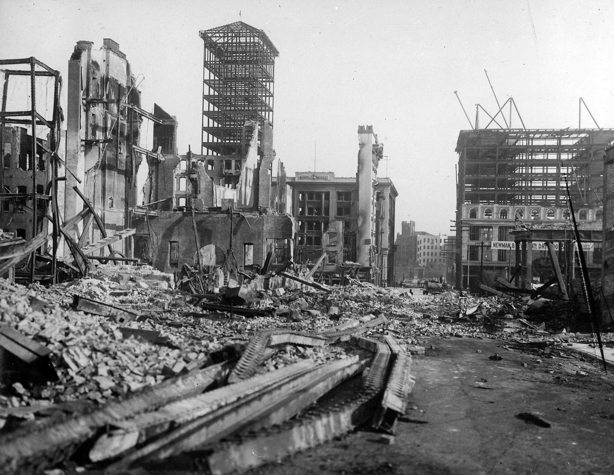
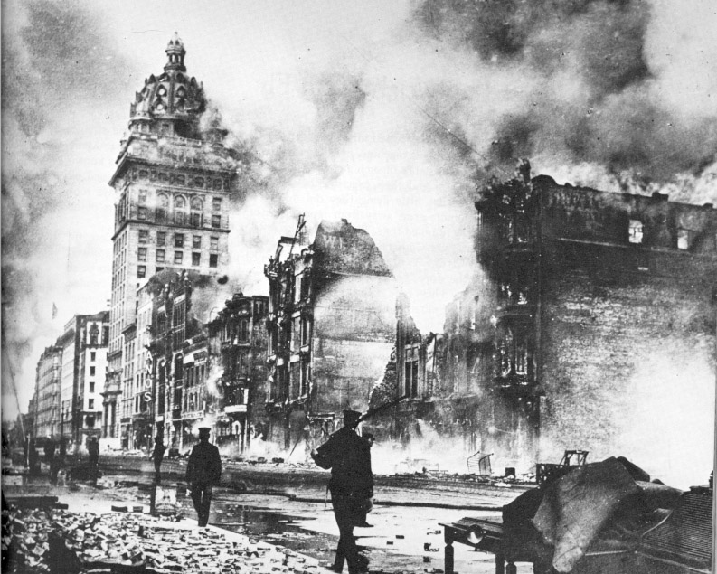
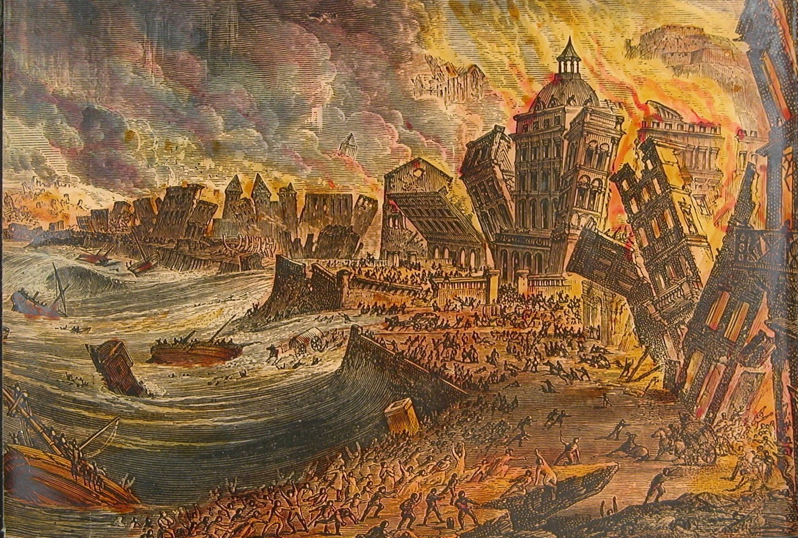
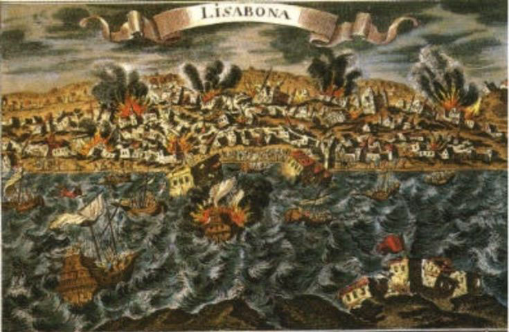

# Enlightenment #

## Rationality ##

- “It may be that universal history is the history of the different intonations given a handful of metaphors." (Jorge Borges) [^1]
- Arguments for God: *a priori* and *empirical*
- Calvin's systematic development of the faith position **sovereignty of God**
- Quakers and Nonconformists: where is highest authority placed?
- Descartes: from scientific method to rational conclusions

[^1]: [Pascal's sphere](https://www.gwern.net/docs/borges/1951-borges-pascalssphere.pdf) where he traces a metaphor about God and the cosmos from the 6th c. BCE up to the 16th CE, all in 3 pages
## Religion and the Age of Reason ##

### San Francisco ###

### Earthquakes ###

### Voltaire ###
   
   - a tale of 2 earthquakes
   - he found the evidence for his belief in nature rather than in the Bible; he doubted a good bit of traditional doctrine—and he didn’t treat religion all that seriously.
   - Revivals but at heart a move from God to human beings
   
   

   Do we explain these by reference to God? No? We are inheritors of Enlightenment.
   
   p. 203 it is the **shifting of place** re. God and world --; what is important
   
   

#### From God-centered to Human-centered ####
   
1. 5 catalysts for change (204)
1. wars of religion
2. Europe divided
3. philosophical attitudes encouraged questioning tradition
4. science seemed to being moving from one accomplishment to another ...;
5. nationalism taking root, centralizing power
6. at the very time of success in discovery and technology, reason seemed to reach its end of life

