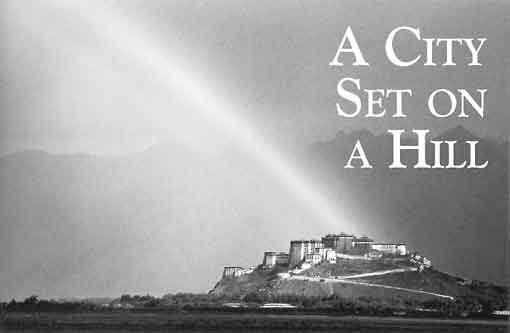
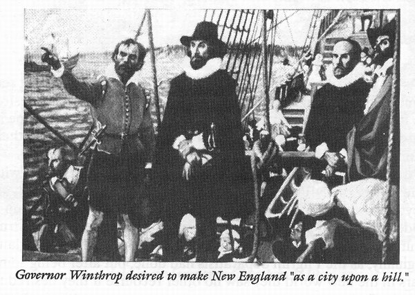

# City on a Hill presentations #

## Overview themes of Church in America ##

- the **idea** of **denomination** really developed in the US
- bewildering variety of developments in US (219)
- New England's covenant with God (219)
- Rational religion in the US (224)
- Revivals on the frontier (225)
- Romanticism in America (228)
- Slavery and black religion (230)

## Key figures ##

- John Winthrop
- Jonathan Edwards
- Great Awakening
- Grimke 

## City on a Hill ##

-   the **idea** of **denomination** really developed in the us
-   bewildering variety of developments in us (219)
-   *Indeed I tremble for my country when I reflect that God is just.* --Thomas Jefferson

------

::: {.NOTES}
Notes:

-   any story of church in America must acknowledge the denominationalism
-   What does the epigraph mean?

 {#section reveal_background="http://izquotes.com/quotes-pictures/quote-for-we-must-consider-that-we-shall-be-as-a-city-upon-a-hill-the-eyes-of-all-people-are-upon-us-so-john-winthrop-311908.jpg" reveal_background_size="1100px" reveal_background_trans="slide"}

note: The vision of a light to the nations.

Quote from Bible. Identifying with a line from Ancient Israel. (Is 49.6)

 {#section-1 reveal_background="http://www.memorywebs.org/Winthrop_John_CityUponHillSpeech1630.jpg" reveal_background_size="1100px" reveal_background_trans="slide"}

Note: Cartoon in faculty room: "Freedom of religion is my short term
goal. My long term goal is to go into real estate."

 {#section-2 reveal_background="https://nahswingspan.com/wp-content/uploads/2016/01/calvin-hobbes-new-years-resolutions.jpg" reveal_background_size="1100px" reveal_background_trans="slide"}

Note: Humor with re. "resolutions"

 {#section-3 reveal_background="http://www.quotehd.com/imagequotes/authors83/jonathan-edwards-clergyman-quote-resolution-one-i-will-live-for-god.jpg" reveal_background_size="1100px" reveal_background_trans="slide"}

Note: Revival of "Great Awakening" **Fire and brimstone** and **heroic
courage**

Sinners in the hands of an angry God (J. Edwards) {#sinners-in-the-hands-of-an-angry-god-j.-edwards reveal_background="https://img00.deviantart.net/513c/i/2012/341/5/6/sinners_in_the_hands_of_an_angry_god_drawing_by_9andrew5-d5ncxhc.jpg" reveal_background_size="1100px" reveal_background_trans="slide"}
:::

----------
[\\]: # (These figures need more elaboration)

### Key Figures ###

-   Wesley & Whitefield
-   John Winthrop
-   Thomas Hooker
-   John Cotton
-   Solomon Stoddard
-   Jonathan Edwards -- associated with the   "**Great Awakening**"

### Rational Religion ###

-   Jefferson & Franklin
-   William Ellery Channing

### Revivals ###

-   Lyman Beecher
-   Charles Finney
-   Ann Lee & Quakers
-   Oneida Community
-   Latter Day Saints
-   Seventh Day Adventists

